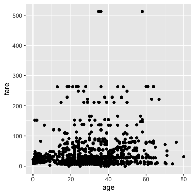

Python flair\!
================

  - [Python in `.Rmd` files](#python-in-.rmd-files)
      - [Load libraries](#load-libraries)
      - [Load data](#load-data)
      - [plot data](#plot-data)
      - [And inline python code within markdown
        text\!](#and-inline-python-code-within-markdown-text)

## Python in `.Rmd` files

### Load libraries

Just like R, you can use Python in `.Rmd` files\! Here we `import` our
libraries

<pre class='sourceCode r'><code><span style='background-color:#ffff7f'>import</span> pandas as pd</code></pre>

### Load data

Let’s use `pd.read_csv` to load the titanic data and view the top of the
data set:

<pre class='sourceCode r'><code>titanic &nbsp;= <span style='background-color:pink'>pd.read_csv</span>("data/titanic.csv")<br>titanic.head()</code></pre>

``` 

##    pclass  survived  ...   body                        home.dest
## 0       1         1  ...    NaN                     St Louis, MO
## 1       1         1  ...    NaN  Montreal, PQ / Chesterville, ON
## 2       1         0  ...    NaN  Montreal, PQ / Chesterville, ON
## 3       1         0  ...  135.0  Montreal, PQ / Chesterville, ON
## 4       1         0  ...    NaN  Montreal, PQ / Chesterville, ON
## 
## [5 rows x 14 columns]
```

### plot data

Passing the python data frame into `ggplot` using `py$data_frame` syntax
to make my scatterplot (what can I say, I love `ggolot2`…).

    ## Warning: Removed 264 rows containing missing values (geom_point).

<pre class='sourceCode r'><code>ggplot2::<span style='background-color:pink'>ggplot(<span style='color:CornflowerBlue'>py$titanic</span>, aes(x = age, y = fare))</span> +<br>&nbsp;&nbsp;geom_point()</code></pre>

<!-- -->

### And inline python code within markdown text\!

Here we find the destination of the first passenger:

<pre class='sourceCode r'><code>first_dest = <span style='background-color:yellow'>titanic["home.dest"][0]</span></code></pre>

The destination of the first passenger is St Louis, MO.
